> Mac OS 환경에서 MSSQL, ASP.Net Core Identity 를 이용하여 Token Base Authentication 을 설정하는 방법, Xamarin Forms을 통해 Api에 접근하는 방법을 정리해 보았습니다.<br/>
> 기본 개발환경 설정에 대한 내용은 아래 환경 세팅 링크를 참조바랍니다.<br/>
> 프로젝트는 기본 템플릿을 이용하였으며, 커스터마이징에 대한 내용은 별도의 자료를 참조하시기 바랍니다.

* * *

# 1. 기본환경 세팅
## 1.1 .Net Core SDK 설치 
- [.Net Core SDK] : https://www.microsoft.com/net/download/core
- [Visual Studio For Mac 설치] : https://www.visualstudio.com/ko/vs/visual-studio-mac/
## 1.2 Docker 설치
- [Install] : https://docs.docker.com/docker-for-mac/install/
- [메뉴얼 참조] : https://docs.docker.com/docker-for-mac/
- [MSSQL 설치] : https://docs.microsoft.com/en-us/sql/linux/sql-server-linux-setup-docker

* * *

# 2. Asp.Net Core Identity & Token Authentication
## 2.1 Asp.Net Core Identity 설치하기
> 참조 : http://www.blinkingcaret.com/2016/11/30/asp-net-identity-core-from-scratch/ <br/>
> .Net Core 1.1 인증 -> 2.0 Migration : https://docs.microsoft.com/en-us/aspnet/core/migration/1x-to-2x/identity-2x <br/>
> .Net Core 2.0 Jwt & Cookie Multi 인증 참조 : https://wildermuth.com/2017/08/19/Two-AuthorizationSchemes-in-ASP-NET-Core-2 <br/>

### 2.1.1 Asp.Net Core Web 프로젝트 생성
>아래 내용은 .Net Core 1.1 을 기준으로 작성이 되었으며, 2.0에 대한 내용은 위 링크 주소를 참조 바랍니다.<br/>

- 1. 파일 > 새 솔루션 > .Net Core Web App Template 선택 
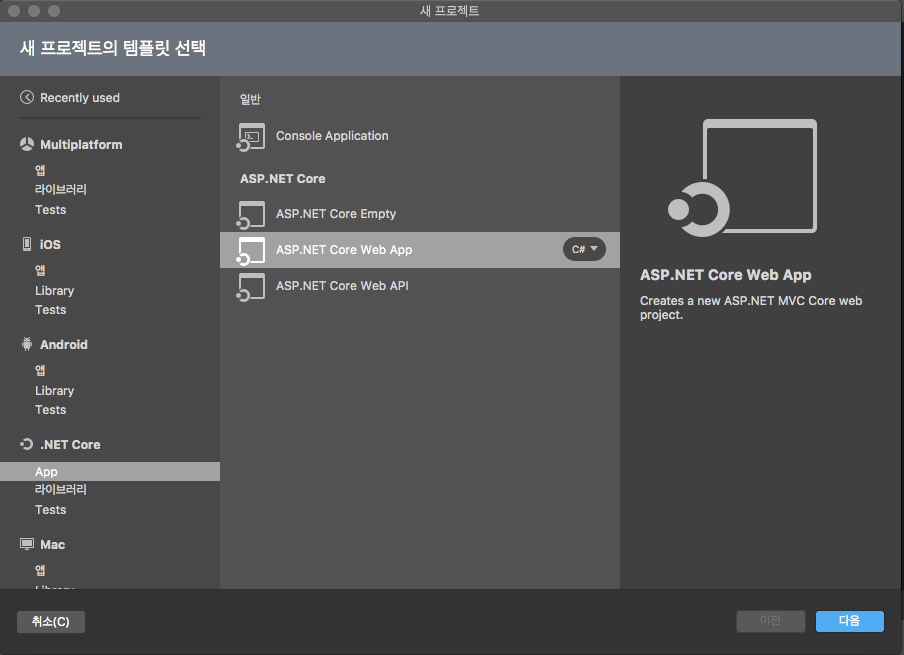
- 2. 프로젝트 이름 설정후 만들기 
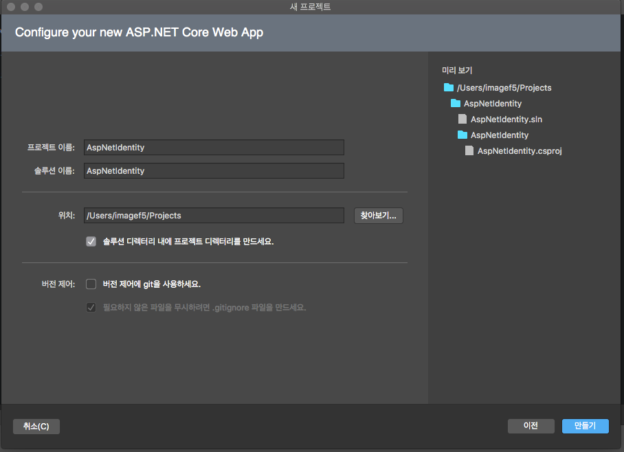

### 2.1.2 Nuget Package 추가
- 1. Microsoft.AspNetCore.Identity.EntityFrameworkCore 패키지 추가
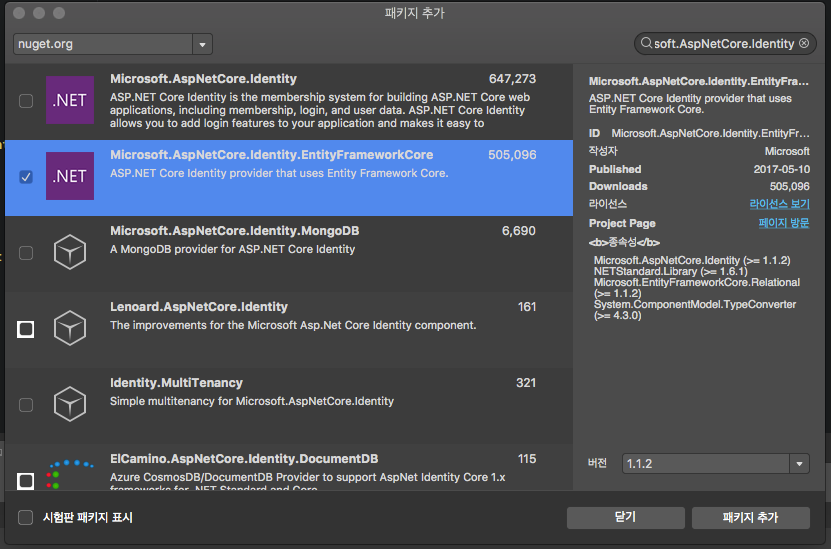 <br/>
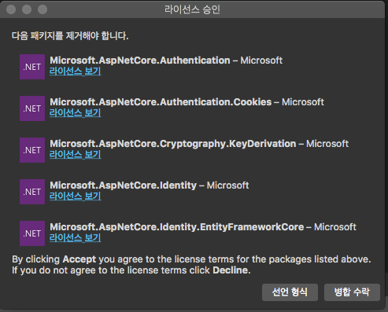

### 2.1.3 IdentityUser Class 로부터 User Class 생성하기
- 1. ApplicationUser Class 추가  (코드의 가독성을 위해 Models 폴더에 생성)
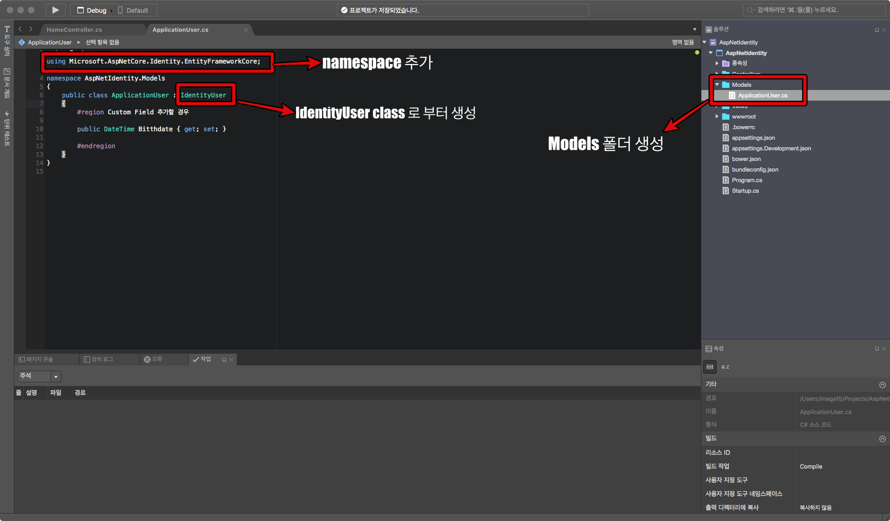

```
using Microsoft.AspNetCore.Identity.EntityFrameworkCore;

...
    public class ApplicationUser : IdentityUser
    {
        #region Custom Field 추가할 경우

        public DateTime Bitthdate { get; set; }

        #endregion
    }
```
- 2. ApplicationContext Class 추가 (DbContext 생성하기)
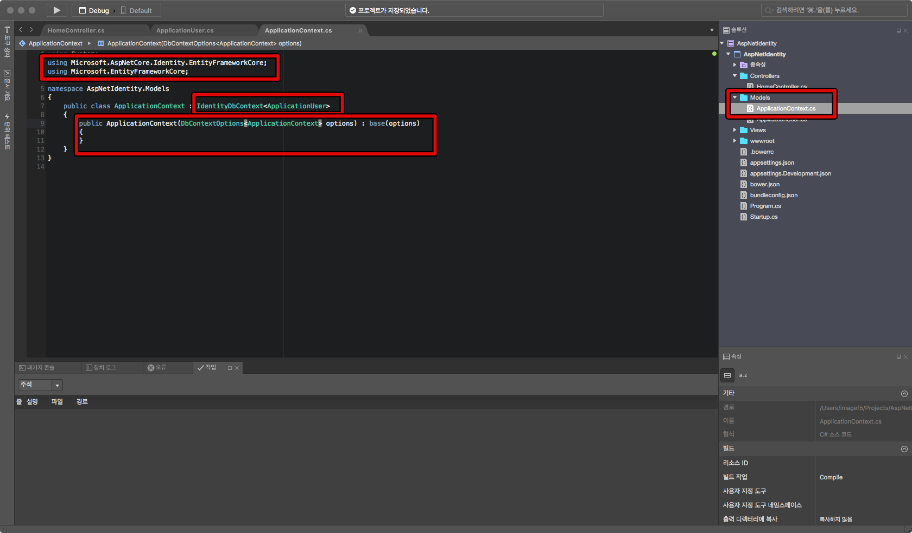

```
using Microsoft.AspNetCore.Identity.EntityFrameworkCore;
using Microsoft.EntityFrameworkCore;

...
    public class ApplicationContext : IdentityDbContext<ApplicationUser>
    {
        public ApplicationContext(DbContextOptions<ApplicationContext> options) : base(options)
        {
        }
    }
```

### 2.1.4 Startup class 서비스 설정
- 1. Start.cs > Identity 서비스 추가 하기
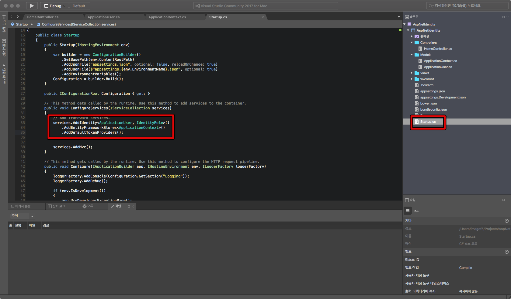
```
    // This method gets called by the runtime. Use this method to add services to the container.
    public void ConfigureServices(IServiceCollection services)
    {
        // Add framework services.
        services.AddIdentity<ApplicationUser, IdentityRole>()
            .AddEntityFrameworkStores<ApplicationContext>()
            .AddDefaultTokenProviders();


        services.AddMvc();
    }
```
- 2. Start.cs > ApplicationBuilder 추가 
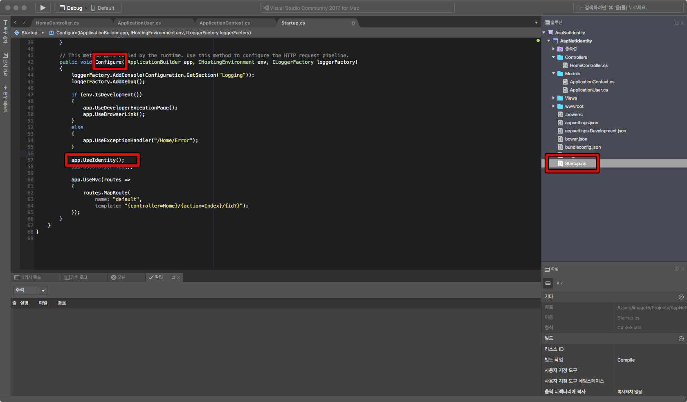
```
    public void Configure(IApplicationBuilder app, IHostingEnvironment env, ILoggerFactory loggerFactory)
    {
        ......

        app.UseIdentity();
        app.UseStaticFiles();

        ......
    }
```
### 2.1.5 Database ConnectionString 설정 및 Migration 
- 1. ConnectionString 추가 : appsettings.json 파일 > ConnectionStrings 항목 추가
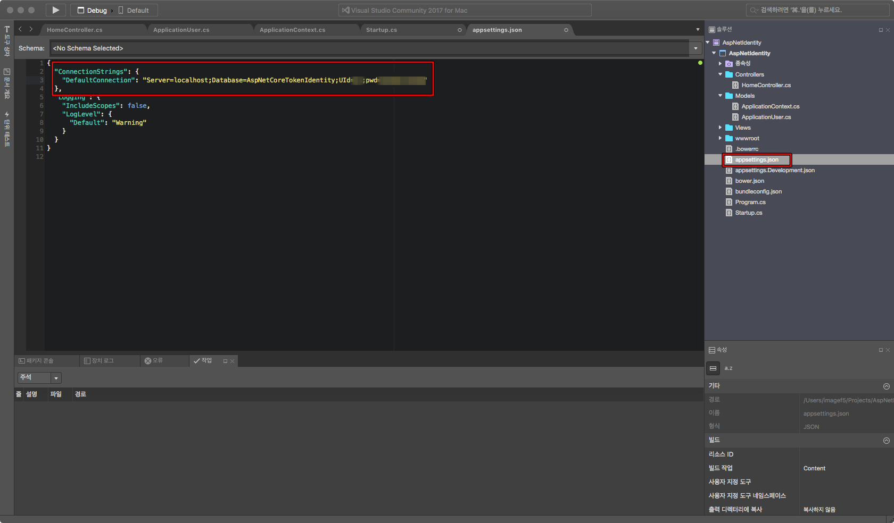 <br/>
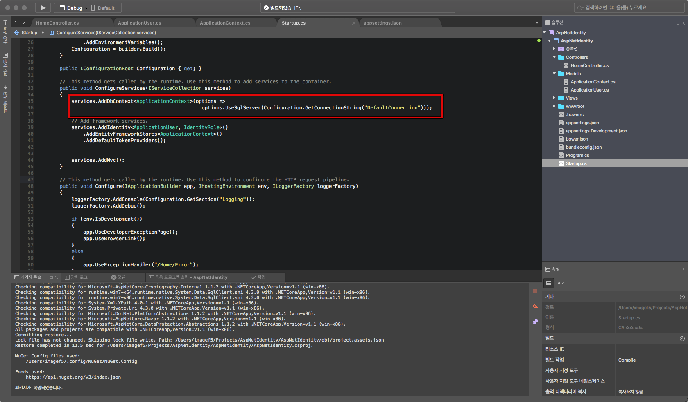

```
    // This method gets called by the runtime. Use this method to add services to the container.
    public void ConfigureServices(IServiceCollection services)
    {
        services.AddDbContext<ApplicationContext>(options =>
                                                    options.UseSqlServer(Configuration.GetConnectionString("DefaultConnection")));

        /* 생략 */
    }
```

- 2. Microsoft.EntityFrameworkCore.Tools 패키지 추가
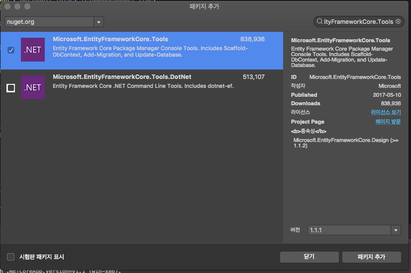
- 4. Microsoft.EntityFrameworkCore.Design 패키지 추가
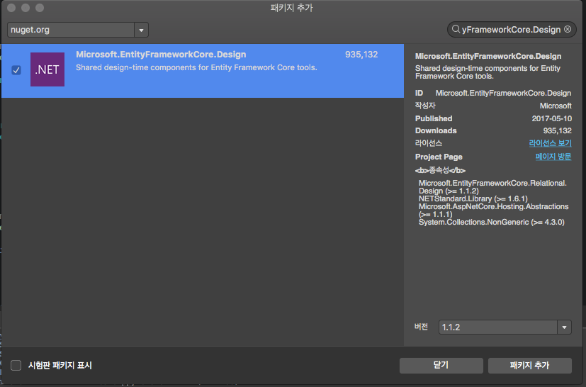
- 5. 프로젝트 오른쪽 마우스 클릭 > 도구 > 파일 편집
```
ItemsGroup Tag 에 다음 코드를 추가
    <DotNetCliToolReference Include=”Microsoft.EntityFrameworkCore.Tools.DotNet” Version=”1.0.1" />
프로젝트 저장
```
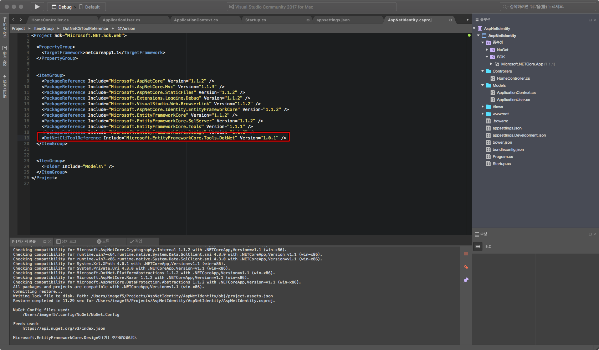

- 6. 프로젝트 오른쪽 마우스 클릭 > 도구 > 터미널에서 열기 -> 다음 명령어 실행
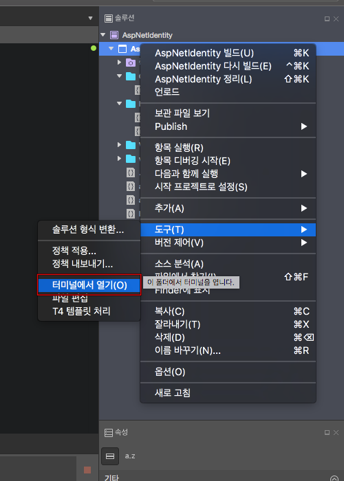

```
   dotnet restore 
```

```
첫번째 migration 생성하기
    dotnet ef migrations add InitialMigration
```
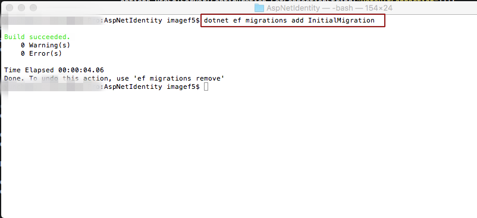

```
    dotnet ef database update
```
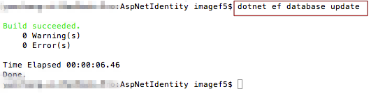

> 추가된 DB 는 Visual Studio Code 를 통하여 확인 가능 <br/>
> Visual Studio Code 를 이용하여 MSSQL 에 접속하기<br/>
> https://docs.microsoft.com/en-us/sql/linux/sql-server-linux-develop-use-vscode

* * * 

## 2.2 Asp.Net Core Token Authentication 추가 하기
> 참고 : https://stormpath.com/blog/token-authentication-asp-net-core

### 2.2.1 Nuget Package 추가

- 1. Microsoft.AspNetCore.Authentication.JwtBearer 패키지 추가<br/>
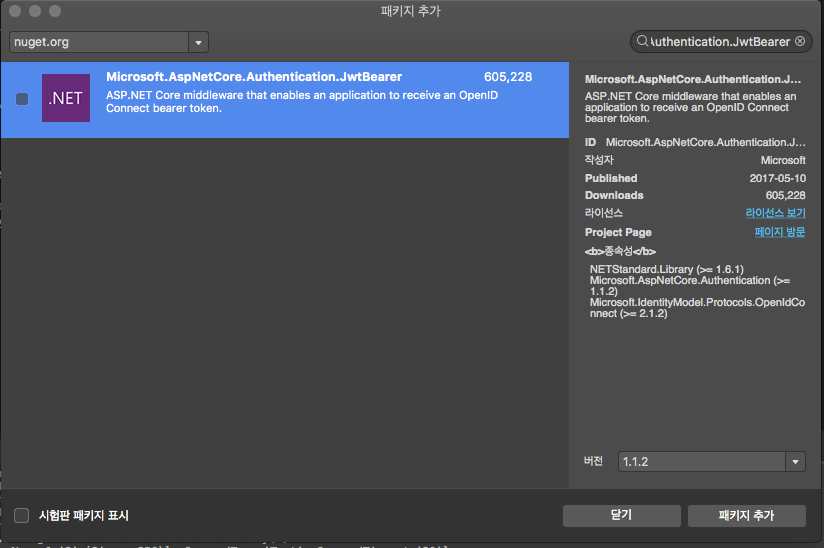

### 2.2.2 Simple Token 발행하기 추가
- 1. Simple Token Endpoint 작성 -> 아래와 같은 코드 추가<br/>
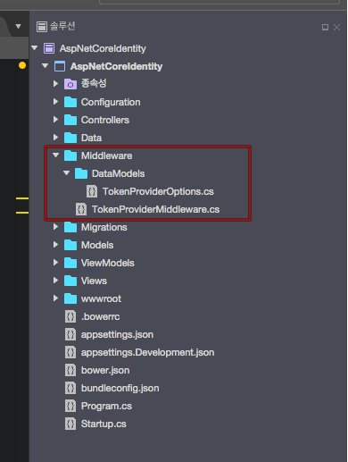

```
TokenProviderOptions.cs

    using System;
    using Microsoft.IdentityModel.Tokens;
    
    ...
        public class TokenProviderOptions
        {
            public string Path { get; set; } = "/token";
    
            public string Issuer { get; set; }
    
            public string Audience { get; set; }
    
            public TimeSpan Expiration { get; set; } = TimeSpan.FromMinutes(5);
    
            public SigningCredentials SigningCredentials { get; set; }
        }
```

```
TokenProviderMiddleware.cs

        using System;
        using System.IdentityModel.Tokens.Jwt;
        using System.Security.Claims;
        using System.Threading.Tasks;
        using Microsoft.AspNetCore.Http;
        using Microsoft.Extensions.Options;
        using Newtonsoft.Json;

        ...
            public class TokenProviderMiddleware
            {
                private readonly RequestDelegate _next;
                private readonly TokenProviderOptions _options;

                public TokenProviderMiddleware(
                    RequestDelegate next,
                    IOptions<TokenProviderOptions> options)
                {
                    _next = next;
                    _options = options.Value;
                }

                public Task Invoke(HttpContext context)
                {
                    // If the request path doesn't match, skip
                    if (!context.Request.Path.Equals(_options.Path, StringComparison.Ordinal))
                    {
                        return _next(context);
                    }

                    // Request must be POST with Content-Type: application/x-www-form-urlencoded
                    if (!context.Request.Method.Equals("POST")
                    || !context.Request.HasFormContentType)
                    {
                        context.Response.StatusCode = 400;
                        return context.Response.WriteAsync("Bad request.");
                    }

                    return GenerateToken(context);
                }

                private async Task GenerateToken(HttpContext context)
                {
                    var username = context.Request.Form["username"];
                    var password = context.Request.Form["password"];

                    ApplicationUser user = null;
                    user = await _userManager.FindByNameAsync(username);
                    var result = _userManager.CheckPasswordAsync(user, password);

                    if (result.Result == false)
                    {
                        context.Response.StatusCode = 400;
                        await context.Response.WriteAsync("Invalid username or password.");
                        return;
                    }

                    var now = DateTime.UtcNow;

                    var userClaims = await _userManager.GetRolesAsync(user);

                    // Specifically add the jti (random nonce), iat (issued timestamp), and sub (subject/user) claims.
                    // You can add other claims here, if you want:
                    var claims = new List<Claim>
                    {
                        new Claim(JwtRegisteredClaimNames.Sub, username),
                        new Claim(JwtRegisteredClaimNames.Jti, Guid.NewGuid().ToString()),
                        new Claim(JwtRegisteredClaimNames.Iat, DateTimeOffset.UtcNow.ToUnixTimeSeconds().ToString(), ClaimValueTypes.Integer64)
                    };

                    foreach(var x in  userClaims)
                    {
                        claims.Add(new Claim(ClaimTypes.Role, x));
                    }
                    // Create the JWT and write it to a string
                    var jwt = new JwtSecurityToken(
                        issuer: _options.Issuer,
                        audience: _options.Audience,
                        claims: claims,
                        notBefore: now,
                        expires: now.Add(_options.Expiration),
                        signingCredentials: _options.SigningCredentials);
                    var encodedJwt = new JwtSecurityTokenHandler().WriteToken(jwt);

                    var response = new
                    {
                        access_token = encodedJwt,
                        expires_in = (int)_options.Expiration.TotalSeconds
                    };

                    // Serialize and return the response
                    context.Response.ContentType = "application/json";
                    await context.Response.WriteAsync(JsonConvert.SerializeObject(response, new JsonSerializerSettings { Formatting = Formatting.Indented }));
                }

            }
```
- 2. StartUp.cs 파일 -> 애플리케이션 파이프 라인에 미들웨어를 추가
```
UseMvc 이전에 추가   

        ......

        //개발환경용으로 세팅됨
        private static readonly string secretKey = "mysupersecret_secretkey!123";
		private static readonly string issure = "ExampleIssuer";
		private static readonly string audience = "ExampleAudience";    

        .......
        
        public void Configure(IApplicationBuilder app, IHostingEnvironment env, ILoggerFactory loggerFactory)
        {
            ......

            app.UseIdentity();
            app.UseStaticFiles();


            #region  start jwt token config
            var signingKey = new SymmetricSecurityKey(Encoding.ASCII.GetBytes(secretKey));
			//generate token

			var jwtOptions = new TokenProviderOptions
			{
				Audience = audience,
				Issuer = issure,
				SigningCredentials = new SigningCredentials(signingKey, SecurityAlgorithms.HmacSha256)
			};

			app.UseMiddleware<TokenProviderMiddleware>(Options.Create(jwtOptions));
            #endregion

            app.UseMvc(routes =>
            {
                routes.MapRoute(
                    name: "default",
                    template: "{controller=Home}/{action=Index}/{id?}");
            });
            
            .....
        }
```

- 3. Postman 이용하여 확인하기
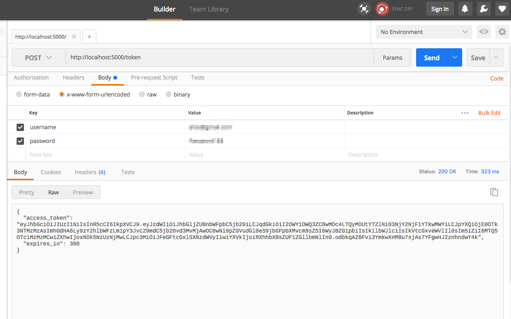

### 2.2.3 Token Validation Check 추가 하기
> # 별도의 Api 프로젝트를 생성하여 테스트를 진행해 보았습니다.

- 1. API 프로젝트 추가 <br/>
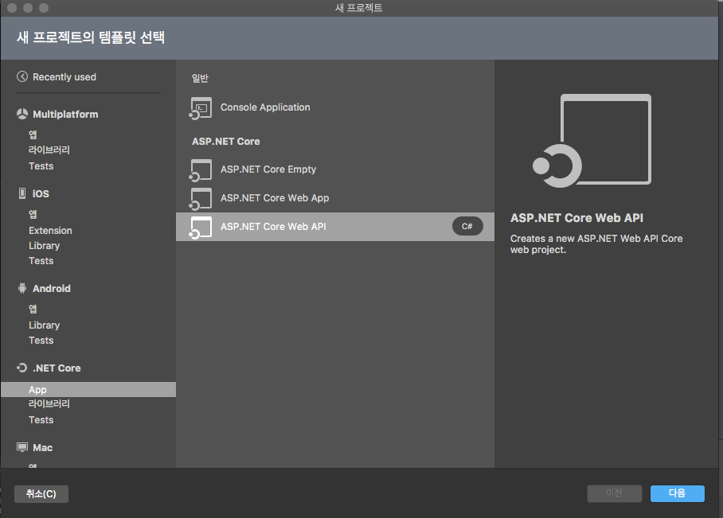 <br/>
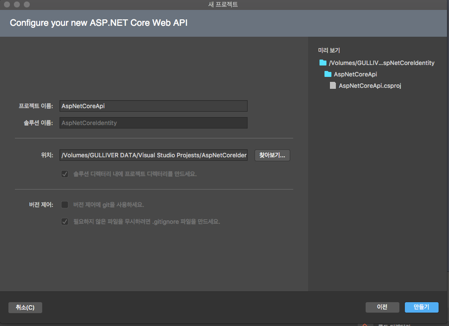 <br/>

- 2. Microsoft.AspNetCore.Authentication.JwtBearer 패키지 추가<br/>


- 3. StartUp.Cs 파일에 Token Validation 코드 추가 <br/>
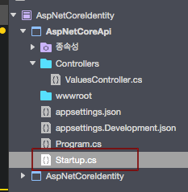

```
    //토큰 발행시 설정했던 코드와 동일하게 설정
    private static readonly string secretKey = "mysupersecret_secretkey!123";
    private static readonly string issure = "ExampleIssuer";
    private static readonly string audience = "ExampleAudience";


    public void Configure(IApplicationBuilder app, IHostingEnvironment env, ILoggerFactory loggerFactory)
    {
        ......

        #region Token Validation Setting
        var signingKey = new SymmetricSecurityKey(Encoding.ASCII.GetBytes(secretKey));
        //generate token

        var tokenValidationParameters = new TokenValidationParameters
        {
            // The signing key must match!
            ValidateIssuerSigningKey = true,
            IssuerSigningKey = signingKey,

            // Validate the JWT Issuer (iss) claim
            ValidateIssuer = true,
            ValidIssuer = issure,

            // Validate the JWT Audience (aud) claim
            ValidateAudience = true,
            ValidAudience = audience,

            // Validate the token expiry
            ValidateLifetime = true,

            // If you want to allow a certain amount of clock drift, set that here:
            ClockSkew = TimeSpan.Zero
        };

        app.UseJwtBearerAuthentication(new JwtBearerOptions
        {
            AutomaticAuthenticate = true,
            AutomaticChallenge = true,
            TokenValidationParameters = tokenValidationParameters
        });
        #endregion

        app.UseMvc();
    }

```

- 4. 테스트를 위해 Controller 에 Authorize Attirbute 추가 <br/>
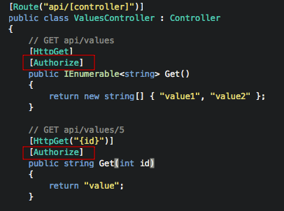

- 5. Postman 으로 테스트해보기 <br/>
    token 발행 주소 설정, username, password 설정후 Send 버튼을 클릭하면 토큰이 발행되는걸 확인 할 수 있음.<br/>
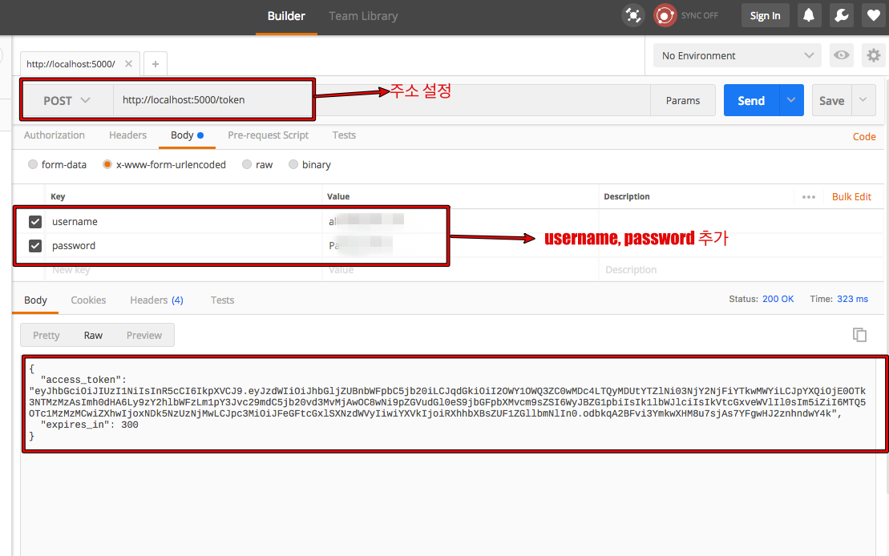<br/><br/>

    Api 주소 설정, Authentication 키 설정후 Send 버튼을 클릭하면 값이 리턴되는걸 확인 할 수 있음. <br/>
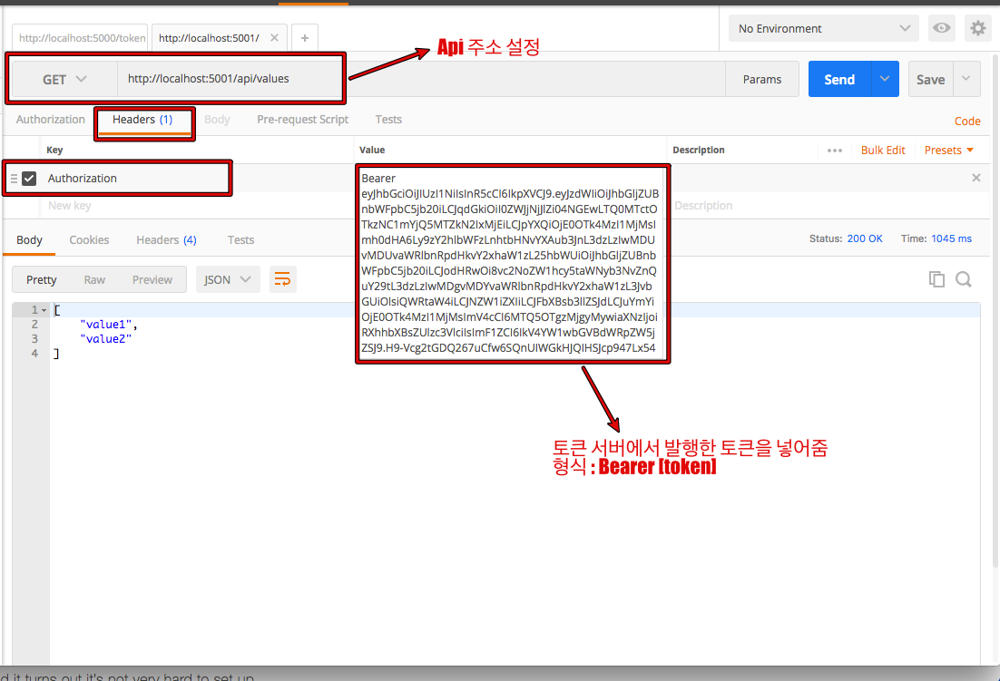<br/>
